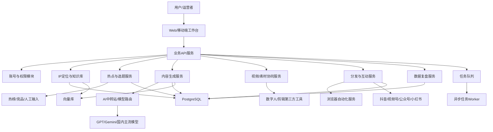

# C端个人IP赋能智能体 PRD

## 1. 文档信息

- 产品名称：C端个人IP赋能智能体
- 版本：V0.1
- 日期：2026-06-22
- 负责人：MJM
- 来源资料：钰桐快速会议纪要
- 当前定位：第一优先级产品，用于先支撑钰桐个人IP账号增长，再沉淀为可复用的C端创作者智能体产品。

## 2. 背景与问题

钰桐账号短期目标是在2026年6月底粉丝破万，但现有内容生产、分发、互动和私域承接已经出现明显人力瓶颈。会议中多次提到，账号需要高频追热点、生成大量文案、制作非真人出镜视频、多平台分发，并处理评论互动和私域引流。如果完全依赖人工，很难支撑日更75-100条内容的强度，也难以稳定复制给其他C端用户。

目标用户不是技术型用户，而是“不懂AI、缺内容产能、缺流量运营能力”的普通创作者、个人IP、知识博主、设计/动漫/短剧类创作者，以及后续想通过AI做商业增长的个体经营者。

因此，本产品应先解决一个最小闭环：围绕个人IP定位，自动完成“热点搜集 -> 文案生成 -> 发布素材准备 -> 多平台分发 -> 评论互动 -> 私域线索承接”的关键流程。剪辑、数字人等能力优先接入成熟第三方工具，不把自己做成剪辑工具，避免进入红海。

## 3. 产品目标

### 3.1 业务目标

1. 支撑钰桐账号在短期内提升内容产能，服务6月底粉丝破万目标。
2. 跑通一套可复用的C端IP获客工作流，后续复制给其他个人IP客户。
3. 通过高频使用场景带动中转站模型调用，沉淀提示词、内容效果、模型效果和分发效果数据。
4. 为B端智能体交付提供样板，把C端验证过的内容和获客能力包装成企业培训后的延伸产品。

### 3.2 用户目标

1. 用户不需要理解复杂AI工具，也能快速获得贴合自己定位的选题、文案和发布内容。
2. 用户能在手机或轻量Web端完成选题确认、文案修改、发布审核、评论回复审核等核心动作。
3. 用户能用少量人工干预管理多个平台的内容发布和互动。
4. 用户能把公域流量自然承接到私域，减少违规引流和封号风险。

## 4. 产品边界

### 4.1 当前要做

1. 个人IP定位配置：人设、行业、目标用户、内容风格、禁用词、产品/服务信息。
2. 热点搜集与选题推荐：抓取热点、行业话题、竞品爆款内容，生成适合账号定位的选题池。
3. 文案生成与改写：根据选题生成短视频口播稿、标题、话题标签、评论引导语、公众号/视频号适配文案。
4. 发布素材工作台：将文案、标签、发布时间、平台适配结果组织成待发布任务。
5. 多平台分发辅助：优先支持半自动分发，逐步探索浏览器自动化或官方接口。
6. 评论互动辅助：根据账号语言风格生成拟人化回复，人工审核后发送。
7. 私域引流辅助：生成低风险、自然表达的引导话术，避免直接违规表达。
8. 数据看板：记录内容发布量、互动量、线索量、爆款内容、模型调用成本。

### 4.2 当前不做

1. 不自研底层大模型。
2. 不自研专业剪辑软件。
3. 不自产硬件或手机矩阵设备。
4. 不承诺绕过平台风控。
5. 不做全自动无人值守账号运营，敏感动作必须保留人工确认。
6. 不在MVP阶段做复杂企业级权限、审批和多组织管理。

## 5. 用户画像

### 5.1 种子用户：钰桐账号运营者

- 诉求：快速追热点、批量产出、维持内容调性、提高粉丝增长和私域转化。
- 痛点：时间不足、账号互动压力大、多平台适配繁琐、内容质量需要人工把控。
- 使用方式：每天筛选选题，审核AI生成内容，确认发布计划，处理重点评论。

### 5.2 标准C端用户：个人IP/知识博主

- 诉求：不知道发什么、不知道怎么写、不知道如何分发和引流。
- 痛点：懂业务但不懂AI，不会搭工作流，不熟悉平台规则。
- 使用方式：配置个人定位后，系统每天生成内容任务包，用户做轻量审核。

### 5.3 延展用户：设计/动漫/短剧类创作者

- 诉求：围绕作品、服务或课程持续获客。
- 痛点：创作时间被营销运营挤压，不会规模化分发。
- 使用方式：接入已有素材库，生成不同平台发布内容和引流话术。

## 6. 产品结构

产品由6个核心部分组成：

1. IP定位与知识库模块
2. 热点与选题模块
3. 内容生成模块
4. 视频/素材协同模块
5. 分发与互动模块
6. 数据与优化模块

### 6.1 IP定位与知识库模块

用于定义账号的“人设边界”和“内容边界”，是后续智能体生成内容的基础。

核心能力：

- 账号基础信息：账号名称、行业、定位、目标客群、主打产品/服务。
- 语言风格：正式、犀利、温和、口语化、专业型等。
- 内容栏目：AI商业增长、AI工具教学、企业转型、短视频获客、案例拆解等。
- 禁区配置：不能说的词、不能碰的平台风险表达、不能承诺的结果。
- 素材知识库：历史爆款文案、过往课程资料、客户案例、常用观点、产品介绍。

MVP要求：

- 支持手动录入账号定位。
- 支持上传文本资料。
- 支持保存3-5套常用内容风格模板。

### 6.2 热点与选题模块

用于解决“今天发什么”的问题。

核心能力：

- 热点采集：抖音热点、视频号热点、微博热搜、百度热点、行业关键词、竞品账号内容。
- 选题过滤：按账号定位、目标用户、内容栏目过滤不相关热点。
- 选题改造：将泛热点改造成适合个人IP的观点型、教学型、案例型、转化型选题。
- 优先级排序：按热度、匹配度、制作难度、潜在转化价值排序。

MVP要求：

- 先支持人工录入热点链接/关键词 + AI改造成选题。
- 第二阶段接入公开热榜或爬虫采集。
- 每天生成20-50个候选选题，人工选择后进入内容生成。

### 6.3 内容生成模块

用于解决“怎么写”和“怎么批量变体”的问题。

核心能力：

- 短视频口播稿：15秒、30秒、60秒脚本。
- 标题生成：平台风格标题、悬念标题、观点标题、痛点标题。
- 标签生成：平台标签、行业标签、人群标签、热点标签。
- 多版本改写：同一选题生成多个角度，避免内容重复。
- 平台适配：抖音、视频号、小红书、公众号等不同表达方式。
- 人设一致性校验：检查是否符合账号语言风格和品牌定位。
- 风险检查：识别夸大承诺、违规引流、敏感表达。

MVP要求：

- 支持短视频文案、标题、标签、评论引导语生成。
- 支持一键改写为不同平台版本。
- 支持人工编辑和最终确认。

### 6.4 视频/素材协同模块

用于连接文案和成片，不把视频制作作为自研核心。

核心能力：

- 数字人平台对接：将口播稿交给第三方数字人工具生成视频。
- 剪辑工具协同：导出适合剪映等工具使用的脚本、字幕、素材说明。
- 素材库管理：保存可复用图片、视频片段、B-roll、封面模板。
- 成片回传：记录最终视频文件、封面、标题和发布平台。

MVP要求：

- 先不做深度剪辑，只生成“视频制作包”。
- 视频制作包包含：脚本、标题、字幕稿、封面文案、素材建议、标签。
- 第三方视频工具可通过手工复制、API或自动化方式逐步接入。

### 6.4.1 MVP子产品：全自动IP视频生成智能体

这是当前最适合当天打样和对外演示的子产品，属于视频/素材协同模块与内容生成模块的交叉能力。用户复制一个爆款视频链接，选择行业、IP风格和引流产品，系统自动完成“爆款结构提取 -> 文案生成 -> 行业改写 -> 音频生成 -> 数字人选择 -> 成片合成 -> 分发内容包”的流程。

核心流程：

1. 输入爆款视频链接。
2. 自动提取原片结构：开场钩子、痛点、数据/案例、转折、行动引导。
3. 根据用户行业和IP定位生成行业改写文案。
4. 生成标题、标签、字幕稿、口播稿。
5. 生成或调用TTS音频。
6. 按行业/IP风格匹配数字人形象。
7. 合成视频预览，并输出抖音、视频号、小红书等平台分发文案。

MVP实现策略：

- 当天演示版先用前端状态机和模板模拟完整流程，证明用户体验和产品价值。
- 第一阶段真实接入模型中转站，完成文案生成和行业改写。目前已增加本地Node适配层，兼容OpenAI风格 `/v1/chat/completions` 中转站接口，未配置时自动降级到本地模板。
- 第二阶段接入TTS与数字人平台，完成真实音频和成片。
- 第三阶段接入发布任务台，形成从生成到分发的完整闭环。

关键接口草案：

```text
POST /api/video/analyze      解析爆款视频结构
POST /api/script/rewrite     生成行业改写文案
POST /api/audio/generate     生成口播音频
POST /api/avatar/render      生成数字人成片
POST /api/publish/package    生成多平台分发包
```

### 6.5 分发与互动模块

这是产品差异化重点，用于解决“人工分发做不完”的问题。

核心能力：

- 发布计划：按平台、账号、时间段生成发布日历。
- 格式适配：不同平台标题长度、正文格式、标签格式、封面比例提示。
- 半自动分发：生成待发布任务，由人工确认后复制发布。
- 浏览器自动化：在技术和合规可控前提下，模拟人工完成部分发布动作。
- 评论回复：基于评论内容、账号风格、私域目标生成拟人化回复。
- 私域引导：用自然表达引导用户主动咨询，避免直接违规表达。
- 风控节奏：控制回复频率、发布频率、重复内容比例，降低封号风险。

MVP要求：

- 第一阶段做“分发任务台 + 复制助手 + 人工确认”。
- 第二阶段调研抖音、视频号、公众号是否可用官方接口或浏览器自动化。
- 评论回复必须先经人工审核。

### 6.6 数据与优化模块

用于判断什么内容有效，并反向优化选题和文案。

核心能力：

- 内容数据：播放、点赞、评论、转发、收藏、涨粉。
- 线索数据：私信数、主动咨询数、入群数、加微信数、成交意向。
- 成本数据：模型调用次数、token成本、第三方工具成本。
- 效果归因：选题、标题、标签、发布时间、平台与结果的关系。
- 内容复盘：自动总结爆款内容共性，并生成下一轮选题建议。

MVP要求：

- 支持人工录入关键数据。
- 支持每周输出内容复盘报告。
- 后续再考虑平台数据自动采集。

## 7. 典型用户流程

### 7.1 首次配置流程

1. 用户创建账号档案。
2. 填写个人定位、目标用户、产品服务、内容禁区。
3. 上传历史文案、课程资料、案例材料。
4. 选择内容风格模板。
5. 系统生成账号内容策略草案。
6. 用户确认后进入日常工作台。

### 7.2 日常内容生产流程

1. 系统生成今日热点和选题池。
2. 用户选择要跟进的选题。
3. 系统生成短视频文案、标题、标签和平台版本。
4. 用户审核并修改。
5. 系统生成视频制作包。
6. 用户或第三方工具完成视频制作。
7. 成片进入发布任务台。

### 7.3 分发与互动流程

1. 系统生成多平台发布计划。
2. 用户确认发布顺序和时间。
3. 系统辅助复制/自动填写平台内容。
4. 发布后记录内容ID和发布时间。
5. 系统汇总评论，生成候选回复。
6. 用户审核重点回复，系统辅助发布。
7. 对高意向用户生成私域引导话术。

### 7.4 复盘优化流程

1. 每天记录核心数据。
2. 每周汇总爆款和低效内容。
3. 系统分析高表现选题、标题、标签、发布时间。
4. 自动更新账号内容策略建议。
5. 下一轮选题和生成策略使用复盘结果。

## 8. 系统架构

### 8.1 架构原则

1. 轻量化：MVP优先使用成熟第三方能力，减少自研范围。
2. 模块化：热点、生成、分发、互动、数据复盘彼此解耦。
3. 人机协同：AI负责批量生成和建议，人负责审核、发布确认和敏感操作。
4. 中转站优先：模型调用统一经过infolink或同类中转层，方便成本控制和数据沉淀。
5. 可替换：第三方模型、数字人、分发方式都要可替换，避免被单一平台锁死。

### 8.2 高层架构图



### 8.3 核心服务划分

#### 前端工作台

职责：

- 账号定位配置
- 选题池浏览
- 文案编辑与审核
- 发布任务管理
- 评论回复审核
- 数据看板

建议形态：

- MVP优先做响应式Web应用。
- 手机端优先适配审核、确认、复制、回复等高频动作。
- 后续根据使用频率再考虑小程序或App。

#### 业务API服务

职责：

- 用户、账号、内容、任务、数据的统一管理
- 调用AI中转站和第三方服务
- 统一鉴权、限流、审计

#### AI编排服务

职责：

- 管理提示词模板
- 调用中转站
- 根据任务类型选择模型
- 输出结构化结果
- 做内容风格校验与风险检查

#### 分发自动化服务

职责：

- 管理平台发布任务
- 支持复制发布、半自动发布、浏览器自动化发布
- 控制频率、记录失败原因
- 处理平台登录态和风控边界

#### 数据复盘服务

职责：

- 记录发布效果
- 计算内容表现
- 生成复盘报告
- 反向优化选题和文案策略

## 9. 技术选型建议

### 9.1 前端

推荐：

- Next.js + React + TypeScript
- Tailwind CSS 或 shadcn/ui
- PWA能力用于移动端快捷访问

理由：

- 开发效率高，适合快速搭建后台/工作台。
- 方便做服务端渲染和API聚合。
- 移动端适配成本低。

备选：

- Vue 3 + Vite + Element Plus：适合团队更熟Vue时使用。
- 微信小程序：不建议MVP先做，除非确认目标用户强依赖微信内操作。

### 9.2 后端

推荐：

- Node.js + NestJS + TypeScript

理由：

- 适合快速构建模块化业务API。
- 与前端同语言，降低团队协作成本。
- 对接浏览器自动化、队列、第三方API方便。

备选：

- Python + FastAPI：如果AI编排、爬虫和数据处理更重，可以作为AI服务独立模块。
- 单体Next.js API Routes：适合极早期Demo，但后续模块复杂后维护性较弱。

### 9.3 AI编排与中转站

推荐：

- 模型调用统一经过 infolink 或同类中转站。
- 自研一层轻量AI Orchestrator，负责提示词、结构化输出、模型选择、重试和日志。
- 优先接入 GPT、Gemini、DeepSeek、通义千问、豆包等高频模型。

理由：

- 保持成本可控，避免每个模型单独接入。
- 为后续模型评测、内容效果分析、算力收费打基础。
- 可按任务类型选择模型，例如热点理解、文案生成、风险检查、标题生成使用不同模型。

### 9.4 数据库与存储

推荐：

- PostgreSQL：保存用户、账号、选题、内容、发布任务、评论、数据指标。
- pgvector 或独立向量库：保存账号知识库、历史文案、案例材料的向量索引。
- Redis：保存任务状态、限流计数、短期缓存。
- S3兼容对象存储：保存封面、视频、素材文件、导出包。

理由：

- 产品核心数据关系明确，PostgreSQL更稳。
- JSONB可以兼容不同平台内容结构。
- 向量检索能支撑账号风格和知识库召回。

### 9.5 队列与异步任务

推荐：

- BullMQ + Redis

适用任务：

- 热点采集
- 批量文案生成
- 风险检查
- 发布任务执行
- 评论抓取
- 数据复盘报告生成

### 9.6 浏览器自动化

推荐：

- Playwright

用途：

- 模拟人工打开平台发布页
- 填写标题、正文、标签
- 截图留痕
- 辅助抓取评论或数据

限制：

- 必须保留人工确认。
- 不承诺绕过平台风控。
- 登录态、验证码、平台规则变化会导致不稳定。
- 敏感平台优先用半自动复制助手，不强行全自动。

### 9.7 监控与日志

推荐：

- Sentry：前后端错误监控
- OpenTelemetry：链路追踪
- Prometheus/Grafana 或轻量云监控：服务指标
- 结构化日志：记录AI调用、成本、任务失败、平台发布状态

## 10. 数据模型草案

### 10.1 核心实体

```text
User 用户
Workspace 工作空间
CreatorProfile IP账号档案
KnowledgeItem 知识库资料
Topic 热点/选题
ContentDraft 内容草稿
PlatformVariant 平台适配版本
MediaPackage 视频制作包
PublishTask 发布任务
Comment 评论
ReplyDraft 回复草稿
Lead 私域线索
Metric 内容数据
ModelCall 模型调用记录
```

### 10.2 关键关系

- 一个用户可以管理多个IP账号。
- 一个IP账号拥有多个知识库资料和内容风格模板。
- 一个选题可以生成多个内容草稿。
- 一个内容草稿可以生成多个平台版本。
- 一个平台版本可以对应一个或多个发布任务。
- 一个发布任务产生平台数据、评论和线索。
- 每次AI生成都记录模型调用、成本、输入输出摘要和效果归因。

## 11. MVP范围

### 11.1 MVP目标

用2-4周跑通钰桐账号的最小闭环：

```text
账号定位配置 -> 热点/选题输入 -> 文案生成 -> 平台适配 -> 发布任务台 -> 人工发布/半自动发布 -> 数据复盘
```

其中，“全自动IP视频生成智能体”作为第一个可演示MVP子产品，先跑通：

```text
爆款链接输入 -> 原片结构提取 -> 行业文案改写 -> 音频/数字人生成 -> 成片预览 -> 多平台分发包
```

### 11.2 MVP功能清单

P0 必须做：

1. IP账号档案配置
2. 知识库文本上传
3. 手动输入热点/链接/关键词
4. AI生成短视频文案、标题、标签
5. 一键生成抖音/视频号/公众号版本
6. 全自动IP视频生成演示闭环
7. 发布任务台
8. 复制发布助手
9. 评论回复候选生成
10. 人工录入核心数据
11. 每周复盘报告

P1 尽快做：

1. 热榜自动采集
2. 竞品账号内容采集
3. 浏览器半自动发布
4. 评论抓取与批量回复建议
5. 数字人工具对接
6. 模型调用成本看板

P2 后续做：

1. 多账号矩阵管理
2. 自动排程发布
3. 私域群运营智能体
4. 线索评分与成交跟进
5. 内容A/B测试
6. 对外商业化套餐和计费

## 12. 关键交互页面

### 12.1 首页工作台

展示：

- 今日待处理选题
- 待审核文案
- 待发布任务
- 待回复评论
- 今日发布量、互动量、线索量

### 12.2 IP账号配置页

展示：

- 账号定位
- 目标用户
- 内容栏目
- 语言风格
- 禁用词和风险规则
- 知识库资料

### 12.3 选题池页面

展示：

- 热点标题
- 来源平台
- 热度
- 与账号匹配度
- 推荐内容角度
- 一键生成文案

### 12.4 内容编辑页

展示：

- 主文案
- 标题候选
- 标签候选
- 平台适配版本
- 风格评分
- 风险提示
- 改写按钮

### 12.4.1 全自动IP视频生成页

展示：

- 爆款视频链接输入
- 行业、IP风格、引流产品配置
- 全自动/人工审核模式切换
- 自动化执行进度：自动化提取、文案生成、行业改写、音频生成、数字人选择、成片合成
- 数字人成片预览
- 原片爆款结构
- 行业改写文案
- 抖音、视频号、小红书分发文案
- 风控检查结果
- 内容包复制/导出

### 12.5 发布任务台

展示：

- 平台
- 发布时间
- 发布状态
- 标题/正文/标签
- 复制按钮
- 自动化尝试状态
- 发布结果记录

### 12.6 评论互动页

展示：

- 评论内容
- 用户意向判断
- 回复候选
- 私域引导建议
- 人工确认发送

### 12.7 数据复盘页

展示：

- 内容表现排行
- 爆款内容共性
- 低效内容原因
- 模型调用成本
- 下周选题建议

## 13. 非功能需求

### 13.1 性能

- 普通页面加载：p95 < 2秒。
- 单条文案生成：p95 < 20秒。
- 批量生成10条文案：p95 < 2分钟。
- 发布任务台操作响应：p95 < 500ms。

### 13.2 可用性

- MVP目标可用性：99%。
- AI模型调用失败时，应自动重试或切换备用模型。
- 自动化发布失败时，应降级为复制发布助手。

### 13.3 安全与合规

- 用户账号凭证加密存储。
- 平台登录态不明文展示。
- 敏感动作保留人工确认。
- 记录发布和回复审计日志。
- 不提供明确规避平台规则、绕过风控的功能说明。

### 13.4 成本

- 记录每次模型调用成本。
- 支持按任务类型选择高性价比模型。
- 高频低价值任务优先使用低成本模型。
- 高价值文案、风格校验可使用更强模型。

### 13.5 可维护性

- 提示词模板版本化。
- 模型供应商可替换。
- 平台发布适配器可插拔。
- 第三方工具接入通过适配器层管理。

## 14. 成功指标

### 14.1 运营指标

- 每日生成选题数
- 每日生成文案数
- 每日发布内容数
- 人工单条内容处理时间
- 多平台分发完成率
- 评论回复处理率

### 14.2 增长指标

- 播放量
- 点赞率
- 评论率
- 转粉率
- 私信/咨询数
- 入群/加微信线索数

### 14.3 产品指标

- 文案采纳率
- 选题采纳率
- AI回复采纳率
- 发布任务成功率
- 自动化失败率
- 单条内容AI成本

### 14.4 MVP验收标准

1. 钰桐账号可用系统每天生成至少50个选题/文案候选。
2. 人工筛选后可形成不少于20条可发布内容任务。
3. 抖音、视频号、公众号至少支持文案格式适配和复制发布。
4. 评论回复候选能明显贴近账号语气，人工可直接使用或轻改。
5. 每周能输出一份内容复盘报告，指出高表现内容共性和下周建议。

## 15. 风险与应对

| 风险 | 影响 | 应对 |
| --- | --- | --- |
| 平台自动化不稳定 | 发布失败、账号风险 | MVP先做半自动复制助手；自动化仅作为辅助能力 |
| AI文案同质化 | 内容质量下降 | 引入账号知识库、历史爆款、人工审核和多角度改写 |
| 平台封号风险 | 业务中断 | 控制频率、敏感词检查、人工确认、避免强引流表达 |
| 第三方模型成本失控 | 毛利下降 | 中转站统一调用、记录成本、按任务分配模型 |
| 热点采集受限 | 选题质量下降 | 支持人工输入、公开热榜、竞品采集多来源兜底 |
| 用户不会配置 | 首次体验差 | 提供模板、示例账号、引导式配置 |
| 剪辑环节卡住 | 内容无法成片 | 先输出视频制作包，接成熟数字人/剪辑工具 |

## 16. 里程碑

### 第1阶段：Demo验证，1周

- 完成账号定位配置
- 完成手动选题输入
- 完成文案、标题、标签生成
- 完成平台适配版本
- 完成发布任务台雏形

### 第2阶段：MVP闭环，2-4周

- 接入知识库
- 增加评论回复候选
- 增加数据录入和周报
- 支持抖音/视频号/公众号复制发布
- 用钰桐账号真实跑一周

### 第3阶段：半自动化，4-8周

- 调研并接入热榜采集
- 接入Playwright半自动发布实验
- 接入数字人或剪辑工具
- 增加模型成本看板
- 沉淀可复制的账号模板

### 第4阶段：产品化，8周后

- 多账号管理
- 套餐计费
- 线索管理
- 私域群运营
- 面向其他C端用户试点

## 17. 关键决策记录

### ADR-001：MVP选择半自动分发，而不是全自动发布

- 决策：第一阶段以发布任务台、复制助手、人工确认为主。
- 原因：抖音、视频号等平台风控严格，登录态、验证码和规则变化都会影响稳定性。
- 取舍：牺牲部分自动化程度，换取账号安全和可控落地。

### ADR-002：不自研剪辑工具

- 决策：视频制作环节先输出制作包，并对接数字人/剪辑第三方工具。
- 原因：剪辑工具竞争激烈，会议中已明确差异化应放在文案、分发、私域承接。
- 取舍：减少视频生成闭环的控制力，但大幅降低研发复杂度。

### ADR-003：模型调用统一走中转站

- 决策：模型调用不在各模块直连供应商，而是通过中转站和AI编排层。
- 原因：便于成本控制、模型替换、效果记录和后续模型评测。
- 取舍：依赖中转站稳定性，需要持续测试infolink或备选方案。

### ADR-004：优先Web响应式工作台

- 决策：MVP不先做原生App或小程序。
- 原因：Web开发最快，适合快速验证；手机端审核和复制动作可通过响应式页面支持。
- 取舍：移动体验不如原生，但足够支持MVP验证。

## 18. 后续待确认问题

1. 钰桐账号当前主要平台优先级：抖音、视频号、公众号、小红书是否排序明确？
2. 日更100条是否指单平台100条，还是多平台合计100条？
3. 是否已有数字人平台、剪辑工具、素材库可直接接入？
4. 评论回复和私域引流的风险边界需要由谁最终确认？
5. MVP是否只服务钰桐账号，还是同步预留对外试用账号？
6. 中转站当前infolink账号、额度、模型列表和稳定性测试结果是否可用？
